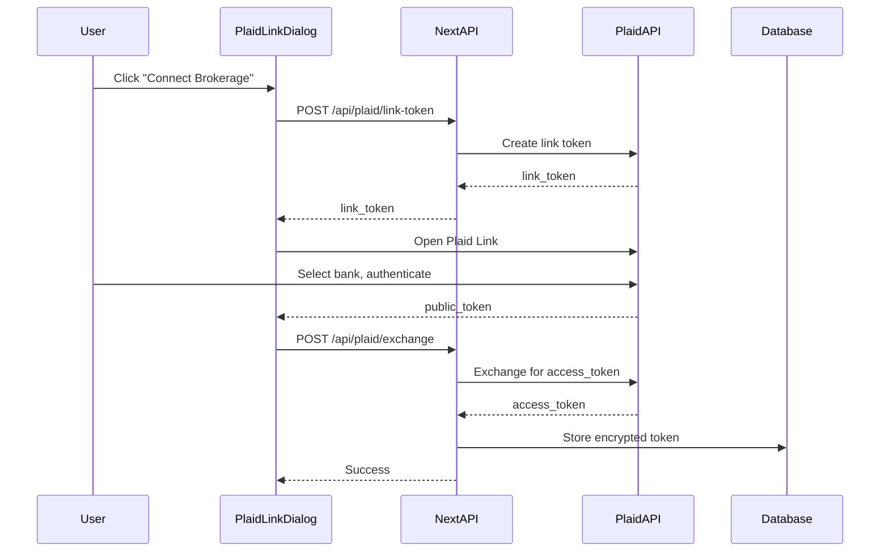

# Plaid Investments Integration

## Dashboard Configuration (Manual Steps)

In Plaid Dashboard, configure:

**Redirect URIs:**

```
https://*.vercel.app/api/plaid/callback
http://localhost:3000/api/plaid/callback
```

**Webhook URL:**

```
https://your-app.vercel.app/api/plaid/webhook
```

## Environment Variables

Add to `.env.example` and your actual `.env`:

```
PLAID_CLIENT_ID=your_client_id
PLAID_SECRET=your_production_secret
PLAID_ENV=sandbox  # or production
```

## Implementation Architecture



## Files to Create

Following the Robinhood pattern in [lib/robinhood/](lib/robinhood/):

1. **`lib/plaid/client.ts`** - Plaid SDK wrapper

   - `createLinkToken()` - Generate Link token for UI
   - `exchangePublicToken()` - Exchange public token for access token
   - `getInvestmentHoldings()` - Fetch holdings
   - `getInvestmentTransactions()` - Fetch transactions
   - `getAccounts()` - List connected accounts

2. **`lib/plaid/types.ts`** - TypeScript interfaces

   - `PlaidSession`, `PlaidHolding`, `PlaidSecurity`, `FormattedPortfolio`

3. **API Routes:**

   - `app/(chat)/api/plaid/route.ts` - Connection status, disconnect
   - `app/(chat)/api/plaid/link-token/route.ts` - Generate Link token
   - `app/(chat)/api/plaid/exchange/route.ts` - Exchange tokens
   - `app/(chat)/api/plaid/webhook/route.ts` - Handle Plaid webhooks
   - `app/(chat)/api/plaid/holdings/route.ts` - Get holdings

4. **`components/plaid-link-dialog.tsx`** - UI component using `react-plaid-link`

5. **Database Schema** - Add to [lib/db/schema.ts](lib/db/schema.ts):
   ```typescript
   export const plaidItem = pgTable("plaid_item", {
     id: uuid().primaryKey().defaultRandom(),
     userId: uuid().notNull().references(() => user.id),
     accessToken: text().notNull(),
     itemId: text().notNull(),
     institutionId: text(),
     institutionName: text(),
     createdAt: timestamp().defaultNow(),
   });
   ```

6. **AI Tools** - Add to [lib/ai/tools/](lib/ai/tools/):

   - `plaidConnect` - Trigger Plaid Link
   - `plaidGetHoldings` - Get investment holdings
   - `plaidGetTransactions` - Get investment transactions

## Dependencies

```bash
pnpm add plaid react-plaid-link
```

## Key Differences from Robinhood

| Aspect | Robinhood | Plaid |

|--------|-----------|-------|

| Auth | Direct credentials + MFA | OAuth via Plaid Link |

| Session | Access/refresh tokens | Access token (long-lived) |

| Multi-broker | No | Yes (IBKR, Schwab, Fidelity, etc.) |

| Data updates | On-demand | Webhooks + on-demand |

## Supported Brokerages via Plaid Investments

- Interactive Brokers (IBKR)
- Charles Schwab
- Fidelity
- TD Ameritrade
- E*TRADE
- Vanguard
- And 100+ more