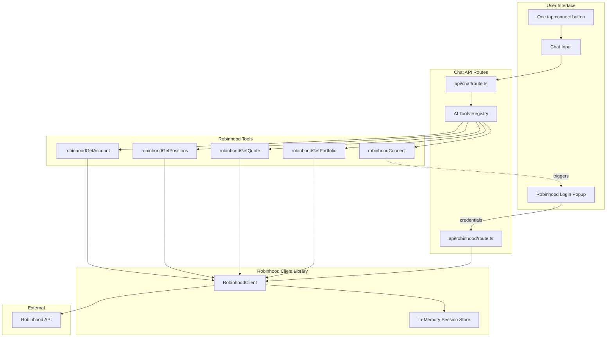
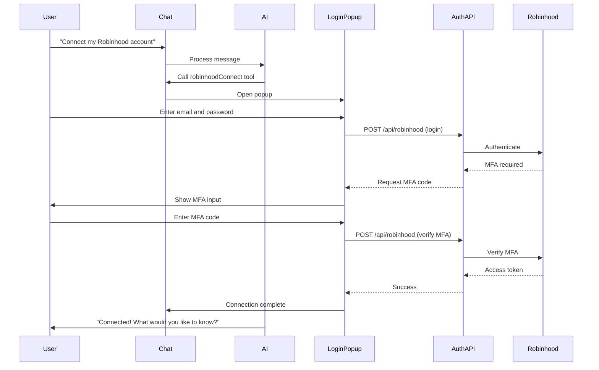

# Robinhood Chat Integration Plan

## Architecture Overview



## Login Flow



## Implementation Details

### 1. Create Robinhood Client Library

**File**: `lib/robinhood/client.ts`

Create a TypeScript client for the Robinhood unofficial API based on [sanko/Robinhood API documentation](https://github.com/sanko/Robinhood):

```typescript
// Core functionality:
- login(email, password, mfaCode?) - Authenticate and get access token
- getAccount() - Fetch account details
- getPortfolio() - Fetch portfolio summary
- getPositions() - Fetch current stock positions
- getQuote(symbol) - Get real-time stock quote
- logout() - Clear session
```

**Session Management**: Use an in-memory Map keyed by user ID to store tokens (cleared on server restart - session-only as requested).

### 2. Create Robinhood Login Dialog

**File**: `components/robinhood-login-dialog.tsx`

A secure popup dialog using existing [dialog.tsx](components/ui/dialog.tsx) primitives:

- **Step 1**: Email and password form fields
- **Step 2**: MFA code input (if required by Robinhood)
- **Success state**: Shows connected confirmation
- **Error handling**: Displays login failures with retry option

Features:

- Password field with type="password" (never visible)
- Loading states during API calls
- Automatic focus management
- Accessible form labels

### 3. Create Robinhood Auth API

**File**: `app/(chat)/api/robinhood/route.ts`

Dedicated API endpoint for Robinhood authentication (separate from chat):

- `POST /api/robinhood` - Login with email/password, or verify MFA
- `GET /api/robinhood` - Check connection status
- `DELETE /api/robinhood` - Logout and clear session

### 4. Create AI Tools

**File**: `lib/ai/tools/robinhood.ts`

Define 5 tools using the existing pattern from [get-weather.ts](lib/ai/tools/get-weather.ts):

| Tool | Purpose | Triggers Popup |

|------|---------|----------------|

| `robinhoodConnect` | Initiate connection (triggers login popup) | Yes |

| `robinhoodGetAccount` | Get account info (buying power, etc.) | No (requires auth) |

| `robinhoodGetPortfolio` | Get portfolio value and P&L | No (requires auth) |

| `robinhoodGetPositions` | List all stock positions | No (requires auth) |

| `robinhoodGetQuote` | Get quote for a stock symbol | No (public) |

The `robinhoodConnect` tool returns a special response that the frontend interprets to open the login popup.

All tools will use `needsApproval: true` for security.

### 5. Update Chat API Route

**File**: `app/(chat)/api/chat/route.ts`

- Import new Robinhood tools
- Add to `experimental_activeTools` array
- Add to `tools` object
```typescript
experimental_activeTools: [
  "getWeather",
  "createDocument",
  // ... existing
  "robinhoodConnect",
  "robinhoodGetAccount",
  "robinhoodGetPortfolio",
  "robinhoodGetPositions",
  "robinhoodGetQuote",
],
tools: {
  // ... existing
  robinhoodConnect,
  robinhoodGetAccount,
  robinhoodGetPortfolio,
  robinhoodGetPositions,
  robinhoodGetQuote,
},
```


### 6. Update System Prompt

**File**: `lib/ai/prompts.ts`

Add instructions for Robinhood tools:

```typescript
// Add to systemPrompt:
- When user wants to connect Robinhood, use robinhoodConnect tool (triggers secure popup)
- How to present portfolio data clearly (tables, percentages, gains/losses)
- Security reminders: credentials entered in popup, never in chat
- If not connected, prompt user to connect first
```

### 7. Integrate Login Dialog in Chat

**File**: `components/chat.tsx`

- Import and render `RobinhoodLoginDialog` component
- Listen for tool responses that trigger the popup
- Handle connection success/failure callbacks

## Robinhood API Endpoints Used

Based on the [unofficial Robinhood API documentation](https://github.com/sanko/Robinhood):

- `POST /oauth2/token` - Authentication
- `GET /accounts/` - Account info
- `GET /portfolios/` - Portfolio data
- `GET /positions/` - Stock positions
- `GET /quotes/{symbol}/` - Stock quotes
- `POST /oauth2/revoke_token` - Logout

## Security Considerations

- **Session-only tokens**: Stored in memory, cleared on restart
- **Tool approval required**: All tools have `needsApproval: true`
- **No credential persistence**: Email/password never stored
- **HTTPS only**: All API calls over secure connection
- **User-scoped sessions**: Tokens keyed by authenticated user ID

## File Changes Summary

| File | Action |

|------|--------|

| `lib/robinhood/client.ts` | Create (new) |

| `lib/robinhood/types.ts` | Create (new) |

| `components/robinhood-login-dialog.tsx` | Create (new) |

| `app/(chat)/api/robinhood/route.ts` | Create (new) |

| `lib/ai/tools/robinhood.ts` | Create (new) |

| `app/(chat)/api/chat/route.ts` | Modify |

| `lib/ai/prompts.ts` | Modify |

| `components/chat.tsx` | Modify |