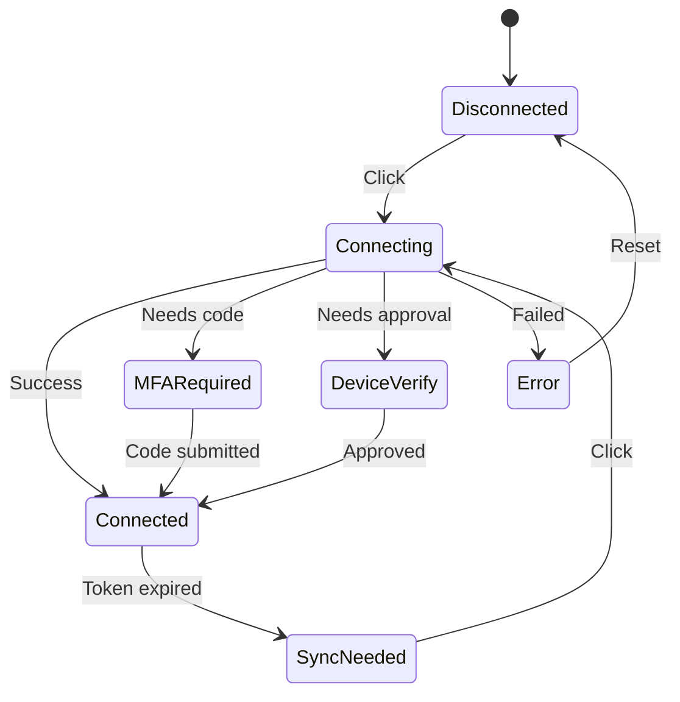

# Robinhood Status Chip

## Overview

Create a new `RobinhoodChip` component - a compact, always-visible pill that shows connection status and portfolio info, replacing the current Robinhood-specific items in suggested actions.

## Component States



**Visual states:**

1. **Disconnected** - Gray chip with "Connect Robinhood" text
2. **Connected** - Green dot + compact value display: "$95.5K +6.7%"
3. **Sync Needed** - Yellow dot + "Sync" text (when token expired)
4. **Connecting** - Spinner animation
5. **Extra Steps** - Blue dot + "Verify" (MFA or device verification pending)

## File Changes

### 1. Create new component: `components/robinhood-chip.tsx`

```tsx
// Compact status chip for Robinhood connection
// Shows: status indicator + portfolio value OR action text
// States: disconnected | connected | sync-needed | verifying | connecting

interface RobinhoodChipProps {
  onConnect: () => void;  // Opens login dialog
}
```

Key features:

- Uses existing `/api/robinhood` and `/api/robinhood/portfolio` endpoints
- Compact format: indicator dot + short text
- Connected shows: `$95.5K +6.7%` (abbreviated currency)
- Click always triggers `onConnect` callback

### 2. Update `components/suggested-actions.tsx`

- Remove all Robinhood-specific logic (portfolio fetching, formatting)
- Remove the Robinhood actions from the grid
- Keep only the 3 generic suggested actions
- Add `RobinhoodChip` as a separate element above the grid

Layout change:

```
Before:                          After:
┌─────────────────────────┐     ┌─────────────────────────┐
│ [RH action] [RH action] │     │ [RobinhoodChip]         │
│ [action]    [action]    │     │ [action] [action]       │
└─────────────────────────┘     │ [action]                │
                                └─────────────────────────┘
```

### 3. Interface for status

Extend the existing `RobinhoodConnectionStatus` type or create chip-specific:

```typescript
type ChipStatus = 
  | "disconnected" 
  | "connected" 
  | "sync-needed" 
  | "connecting" 
  | "verify-needed";
```

## Implementation Notes

- Chip width: auto (fits content), max ~200px
- Use `text-xs` for compact display
- Abbreviated numbers: `$95,522.35` -> `$95.5K`
- Green/red for positive/negative change
- Status dot: 6px circle with appropriate color
- Clicking chip in any state opens the login dialog (for reconnect/verify)